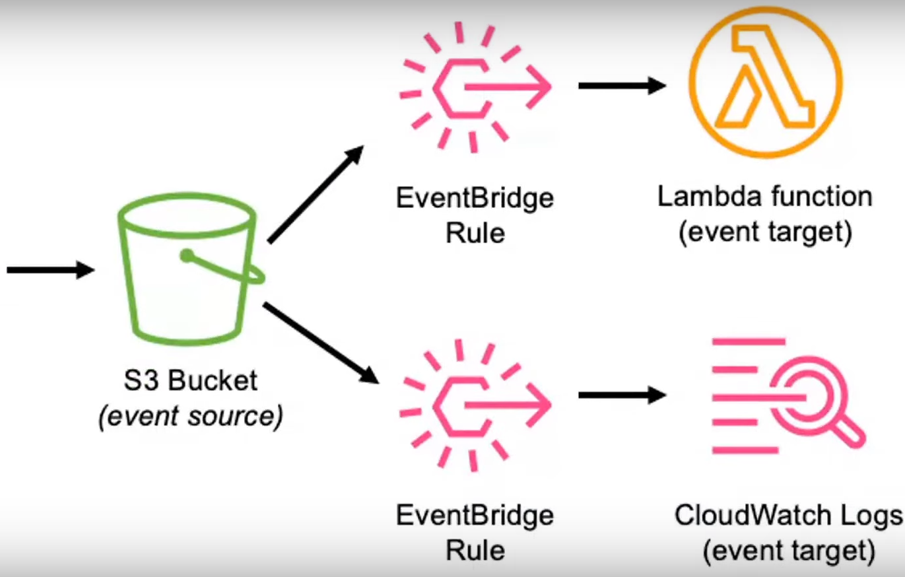
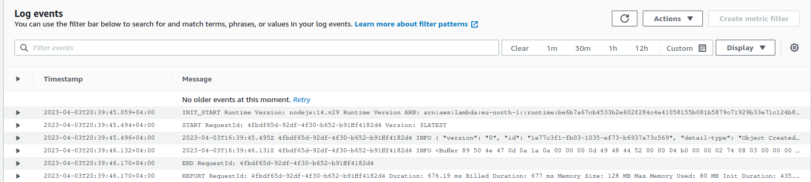

# AmazonEventBridge (Event Driven Architecture)
Event Driven Application with Event Bridge (S3 - EventBridge - Lambda Function)
S3 EventBridge Pattern

This is a  serverless application that demonstrates how to build an event-driven architecture using AWS S3 and EventBridge.
Overview

This pattern uses the following AWS services:

    AWS S3: Object storage service for storing and retrieving data
    AWS EventBridge: Serverless event bus service for receiving and routing events between AWS services
    AWS Lambda: Serverless compute service for executing code in response to events

The architecture of the pattern is as follows:

    An S3 bucket is created with an event notification configuration that sends an event to EventBridge when an object is created or deleted in the bucket.
    An EventBridge rule is created that listens for the S3 events and routes them to a Lambda function.
    The Lambda function is triggered by the S3 event and processes the object data.

Prerequisites

Before you can deploy the pattern, you need to have the following prerequisites:

    AWS CLI: Command-line interface for interacting with AWS services
    AWS SAM CLI: Framework for building and deploying serverless applications using AWS SAM
    Docker: Platform for building and running containerized applications

Getting Started

To get started with the pattern, follow these steps:

    Clone the repository and navigate to the project directory:

    bash

git clone https://github.com/<your-github-username>/s3-eventbridge-pattern.git
cd s3-eventbridge-pattern

Build the Lambda function:

bash

sam build

This command will build the Lambda function and its dependencies.

Deploy the pattern:

bash

sam deploy --guided

This command will deploy the pattern to your AWS account. You will be prompted to enter some parameters, such as the S3 bucket name and Lambda function name.

Test the pattern:

    Upload a file to the S3 bucket:

    bash

aws s3 cp <file> s3://<bucket>

This command will upload a file to the S3 bucket and trigger an event.For this project I will upload a png to the s3 bucket created by SAM Cli.

Check the Lambda function logs:
The logs of out CloudWatch can be viewed through Lambda Monitoring tab.Following is the result after uploading the png:

bash

    sam logs -n MyFunction --stack-name <stack-name> --tail

    This command will show the logs generated by the Lambda function. You should see a message indicating that the object was processed.

Clean up:

To delete the pattern and its resources, run the following command:

bash

    sam delete

    This command will delete the CloudFormation stack that was created by the sam deploy command. You will be prompted to confirm the deletion.

Conclusion

This pattern demonstrates how to build an event-driven architecture using AWS S3 and EventBridge. By routing S3 events to a Lambda function, you can process object data in real-time and build powerful serverless applications.
